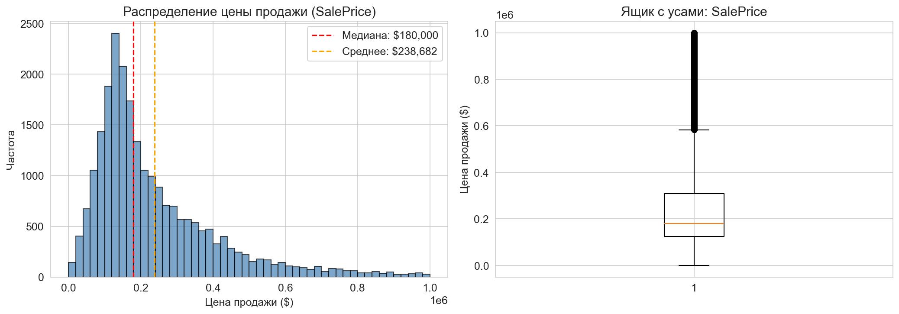
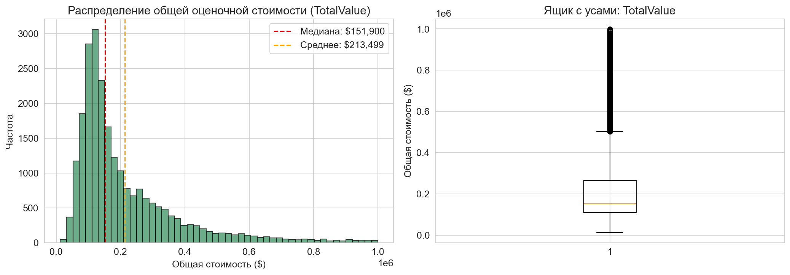
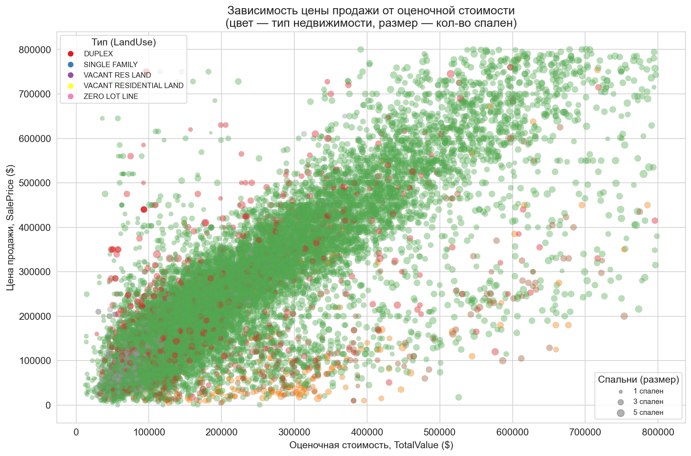

# Отчёт по лабораторной работе №1

**Дисциплина:** Анализ больших данных

**Тема:** Реляционные данные. Исследовательский анализ данных. Построение визуализаций данных OLAP

## 1. Формулировка задач

**Цель:** провести первичный анализ реляционной базы данных с помощью Python, pandas и библиотеки для подключения к БД.

**Задачи:**

- Создать базу данных из файлов согласно варианту
- Подключиться к БД из Python
- Описать данные: таблицы, поля, типы, шкалы признаков
- Одномерный анализ: построить гистограммы количественных признаков
- Многомерный анализ: построить график из 3–4 признаков

## 2. Вариант и сложность

- **Вариант:** 16 — Housing - SQL Project (Nashville Housing Data)
- **Источник:** [Kaggle](https://www.kaggle.com/datasets/bvanntruong/housing-sql-project)
- **Сложность:** Rare (SQLite3)

## 3. Ссылка на репозиторий

> *Репозиторий:* [https://github.com/Pavelavl/big-data-analysis]

Структура проекта:

```
lab1/
├── create_db.py               # Скрипт создания SQLite БД из CSV
├── nashville_housing.db       # SQLite база данных
├── Nashville Housing.csv      # Исходные данные
├── lab1_analysis.ipynb        # Jupyter Notebook с анализом
├── hist_sale_price.png        # Гистограмма SalePrice
├── hist_total_value.png       # Гистограмма TotalValue
├── multivariate_plot.png      # Многомерный график
└── README.md
```

## 4. Описание проделанной работы

### 4.1 Создание БД и подключение

Из CSV-файла (56 477 записей) создана SQLite БД с таблицей `housing` (19 полей). Подключение — через `sqlite3`.

### 4.2 Описание данных

| Признак | Тип | Шкала | Описание |
|---------|-----|-------|----------|
| SalePrice | REAL | Отношений | Цена продажи ($) |
| TotalValue | REAL | Отношений | Общая оценочная стоимость ($) |
| Acreage | REAL | Отношений | Площадь участка (акры) |
| LandValue | REAL | Отношений | Стоимость земли ($) |
| BuildingValue | REAL | Отношений | Стоимость здания ($) |
| YearBuilt | INTEGER | Интервальная | Год постройки |
| Bedrooms | INTEGER | Отношений | Количество спален |
| FullBath | INTEGER | Отношений | Полные ванные |
| HalfBath | INTEGER | Отношений | Полуванные |
| LandUse | TEXT | Номинальная | Тип использования земли |
| SoldAsVacant | TEXT | Бинарная | Продано как свободный участок |
| TaxDistrict | TEXT | Номинальная | Налоговый округ |

### 4.3 Одномерный анализ

**Гистограмма SalePrice:**



Распределение — правосторонняя асимметрия. Основная масса: $100 000 – $300 000. Медиана ниже среднего — наличие дорогих выбросов.

**Гистограмма TotalValue:**



Аналогичная правосторонняя асимметрия. Основная масса: $50 000 – $300 000. Оценочная стоимость в среднем ниже рыночной цены продажи.

### 4.4 Многомерный анализ

Scatter-plot по 4 признакам: SalePrice (Y), TotalValue (X), LandUse (цвет), Bedrooms (размер).



Выявлена сильная линейная зависимость между TotalValue и SalePrice. Тип недвижимости (LandUse) определяет ценовой сегмент. Количество спален коррелирует со стоимостью.

## 5. Вывод

Реализован Jupyter Notebook для исследовательского анализа базы данных Nashville Housing (56 477 записей, 19 признаков).

Программа выполняет:
- Подключение к SQLite БД и загрузку данных в pandas DataFrame
- Описание структуры данных и анализ пропусков
- Построение 2 гистограмм (SalePrice, TotalValue) с описательной статистикой
- Построение многомерного scatter-plot с 4 признаками

Основные результаты: распределения цен имеют правостороннюю асимметрию; между рыночной и оценочной стоимостью существует сильная линейная связь.

## 6. Используемые материалы

- [Python sqlite3 — документация](https://docs.python.org/3/library/sqlite3.html)
- [pandas — документация](https://pandas.pydata.org/docs/)
- [matplotlib — документация](https://matplotlib.org/stable/contents.html)
- [seaborn — документация](https://seaborn.pydata.org/)
- [SQLite в Python — руководство](https://pythonru.com/osnovy/sqlite-v-python)
- [Kaggle: Housing - SQL Project](https://www.kaggle.com/datasets/bvanntruong/housing-sql-project)
