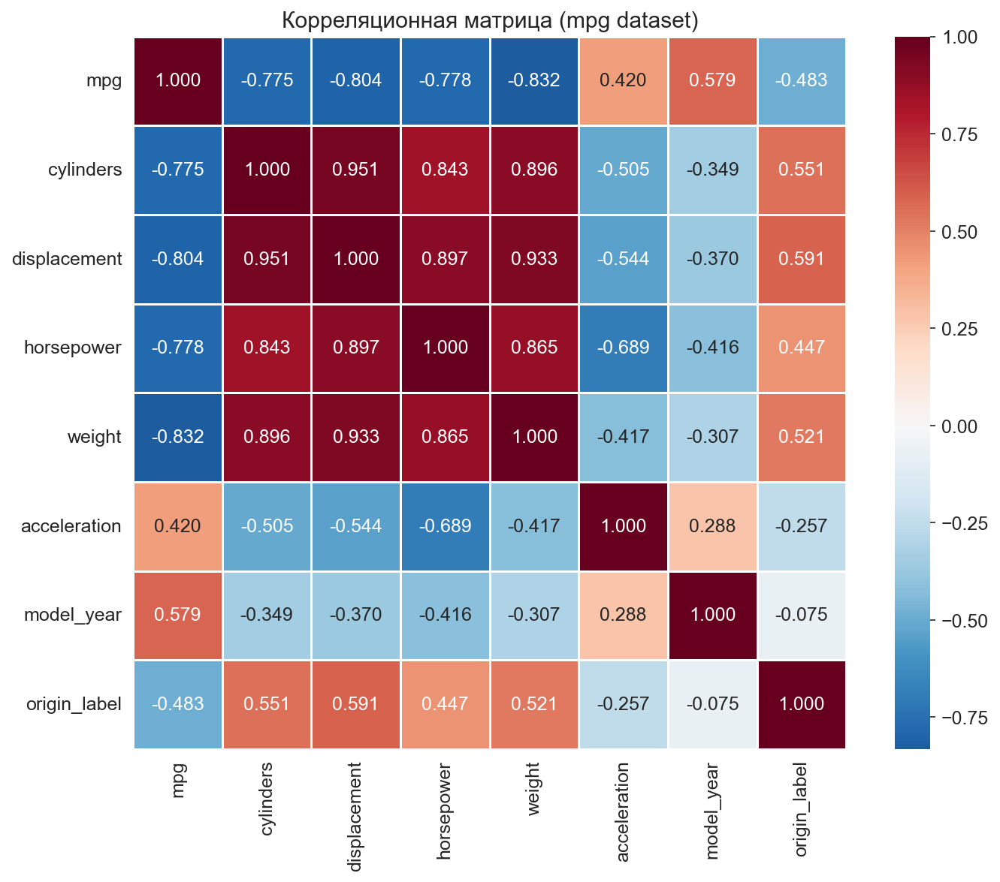
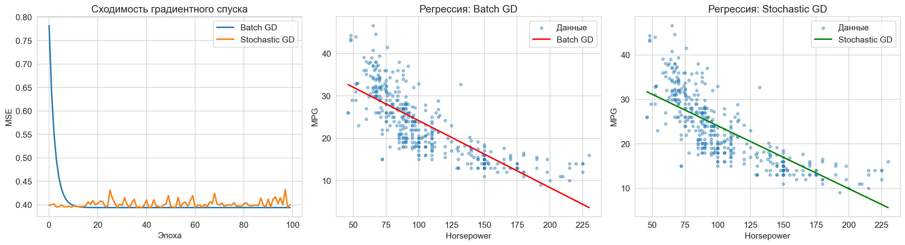
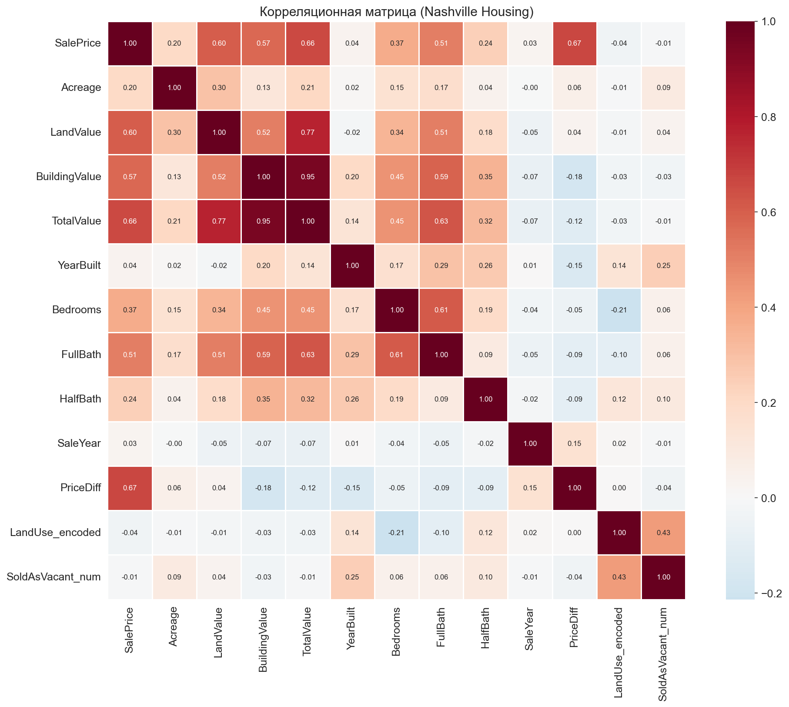

# Отчёт по лабораторной работе №2

**Дисциплина:** Анализ больших данных

**Тема:** Исследовательский анализ данных. Постановка гипотез. Категориальные данные

## 1. Формулировка задач

**Цель:** провести исследовательский анализ данных, поставить гипотезы и выявить основные статистики.

**Задачи:**

- Ознакомиться с набором данных mpg из библиотеки Seaborn
- Провести разведочный анализ числовых и категориальных переменных
- Сформулировать и проверить статистические гипотезы
- Закодировать категориальные переменные (LabelEncoding, OneHotEncoding)
- Построить таблицу корреляции признаков и целевого столбца
- Реализовать обычный и стохастический градиентный спуск
- Повторить аналогичный анализ для данных варианта (Nashville Housing)

## 2. Вариант и сложность

- **Вариант:** 16 — Housing - SQL Project (Nashville Housing Data)
- **Источник:** [Kaggle](https://www.kaggle.com/datasets/bvanntruong/housing-sql-project)
- **Сложность:** Medium (общая + самостоятельная часть)

## 3. Ссылка на репозиторий

> *Репозиторий:* [https://github.com/Pavelavl/big-data-analysis]

Структура проекта:

```
lab2/
├── lab2_analysis.ipynb        # Jupyter Notebook с анализом
├── corr_mpg.png               # Корреляционная матрица (mpg)
├── gradient_descent.png       # Графики градиентного спуска
├── corr_housing.png           # Корреляционная матрица (Nashville Housing)
└── README.md
```

## 4. Описание проделанной работы

### 4.1 Часть 1: Общее задание (mpg)

#### Загрузка и EDA

Загружен датасет mpg из Seaborn (398 строк, 9 столбцов). Для каждой числовой переменной вычислены: доля пропусков, мин/макс, среднее, медиана, дисперсия, квантили 0.1/0.9, квартили Q1/Q3. Для категориальных: доля пропусков, количество уникальных значений, мода.

#### Статистические гипотезы

**Гипотеза 1** — расход топлива различается между автомобилями из USA и Japan:
- Критерий: t-критерий Уэлча. Обоснование: сравниваем средние двух независимых выборок (n_USA=249, n_Japan=79 — обе > 30, по ЦПТ нормальность обеспечена). Критерий Уэлча выбран вместо классического t-теста, т.к. дисперсии выборок могут различаться.
- Результат: H₀ отвергнута (p < 0.001). Японские автомобили статистически значимо экономичнее американских.

**Гипотеза 2** — корреляция между весом автомобиля (weight) и расходом топлива (mpg):
- Критерий: коэффициент корреляции Пирсона. Обоснование: оба признака количественные (шкала отношений), проверяем линейную связь, визуально зависимость близка к линейной, выборка большая (n=398).
- Результат: H₀ отвергнута (p < 0.001). Обнаружена сильная отрицательная корреляция (r=−0.83) — чем тяжелее автомобиль, тем ниже mpg.

#### Кодирование

Для переменной `origin` выполнено LabelEncoding (europe=0, japan=1, usa=2) и OneHotEncoding (origin_europe, origin_japan, origin_usa).

#### Корреляционная матрица

Целевой столбец: **mpg** (расход топлива). Построена heatmap корреляции. Наиболее сильные корреляты: weight (−0.83), displacement (−0.80), cylinders (−0.78).



#### Градиентный спуск

Реализованы обычный (batch) и стохастический (SGD) градиентный спуск для линейной регрессии y=mpg, x=horsepower. Оба метода сходятся к близким значениям параметров. Batch GD сходится плавно, SGD — с колебаниями.



### 4.2 Часть 2: Самостоятельное задание (Nashville Housing)

#### Загрузка и преобразования

Данные загружены из SQLite БД (`nashville_housing.db`): 56 477 строк, 19 столбцов. Добавлены вычисляемые столбцы:
- **SaleYear** — год продажи, извлечённый из SaleDate
- **PriceDiff** — разница между ценой продажи и оценочной стоимостью (SalePrice − TotalValue)
- **LandUse_encoded** — LabelEncoding для типа использования земли
- **SoldAsVacant_num** — числовое представление (Yes=1, No=0)

#### EDA

Для 13 числовых переменных вычислены все требуемые статистики. Для 3 категориальных (LandUse, SoldAsVacant, TaxDistrict) — пропуски, уникальные значения, мода.

#### Статистические гипотезы

**Гипотеза 1** — цена продажи различается для SINGLE FAMILY и RESIDENTIAL CONDO:
- Критерий: t-критерий Уэлча. Обоснование: сравниваем средние двух независимых групп (n_SF=34 194, n_RC=14 077 — обе >> 30, ЦПТ). Критерий Уэлча выбран, т.к. группы различаются по размеру и по дисперсии цен (разные сегменты рынка).
- Результат: H₀ отвергнута (p < 0.001). Кондоминиумы в среднем дороже частных домов в Нэшвилле.

**Гипотеза 2** — цена продажи различается для SoldAsVacant=Yes и SoldAsVacant=No:
- Критерий: t-критерий Уэлча. Обоснование: сравниваем средние двух независимых групп (n_Yes=4 623, n_No=51 396). Размеры выборок различаются в 11 раз, дисперсии предположительно неравны — выбран критерий Уэлча.
- Результат: H₀ отвергнута (p = 0.008). Цена продажи статистически значимо различается для свободных участков и объектов с постройками.

#### Корреляционная матрица

Целевой столбец: **SalePrice**. Наиболее сильные корреляты: TotalValue, BuildingValue, LandValue.



## 5. Вывод

Реализован Jupyter Notebook для исследовательского анализа данных, проверки статистических гипотез и реализации градиентного спуска.

**Часть 1 (mpg, 398 записей):**
- Проведён полный EDA для 7 числовых и 2 категориальных переменных
- Проверены 2 гипотезы: различия mpg между странами и корреляция weight-mpg
- Выполнено кодирование переменной origin (LabelEncoding + OneHotEncoding)
- Реализованы batch и стохастический градиентный спуск для линейной регрессии mpg ~ horsepower

**Часть 2 (Nashville Housing, 56 477 записей):**
- Добавлены 4 вычисляемых столбца
- Проведён полный EDA для 13 числовых и 3 категориальных переменных
- Проверены 2 гипотезы о различиях цен по типу недвижимости и статусу
- Построена корреляционная матрица с 13 признаками

## 6. Используемые материалы

- [pandas — документация](https://pandas.pydata.org/docs/)
- [numpy — документация](https://numpy.org/doc/)
- [seaborn — документация](https://seaborn.pydata.org/)
- [matplotlib — документация](https://matplotlib.org/stable/contents.html)
- [scipy.stats — документация](https://docs.scipy.org/doc/scipy/reference/stats.html)
- [scikit-learn — LabelEncoder](https://scikit-learn.org/stable/modules/generated/sklearn.preprocessing.LabelEncoder.html)
- [Градиентный спуск — Habr](https://habr.com/ru/articles/471458/)
- [Kaggle: Housing - SQL Project](https://www.kaggle.com/datasets/bvanntruong/housing-sql-project)
